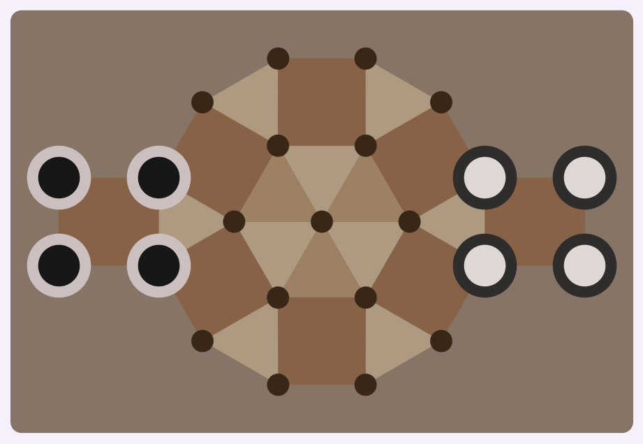

# 🌀 Tarati — A Board Game by George Spencer Brown


<div style="text-align: center; margin: 0 auto; max-width: 100%;">

[](https://kotlinlang.org)
[](https://developer.android.com/jetpack/compose)
[](https://www.android.com)
[](LICENSE)
[](README.md)

**A native Android implementation of the fascinating strategy game Tarati**

[Download APK](#-download) • [How to Play](#-how-to-play) • [Features](#-features)

</div>

## 📖 About the Game

Tarati is a strategic board game created by **George Spencer Brown**, the brilliant author of "Laws of Form". This game
combines elements of chess and checkers with unique movement and capture mechanics, based on Spencer Brown's calculus of
distinctions.

> *"A game of distinctions and decisions" - George Spencer Brown*



This application is a complete adaptation to **Kotlin and Jetpack Compose** of
the [original React implementation](https://github.com/adamblvck/tarati-react) created by **Adam Blvck**.

## 🚀 Features

### 🎯 Gameplay

- **Two players**: White vs Black with 4 pieces each
- **Smart AI**: 4 configurable difficulty levels
- **Touch movement**: Intuitive tap-and-move interface
- **Complete history**: Undo/redo move system
- **Authentic rules**: Faithful to Spencer Brown's original design

### 🎨 User Experience

- **Modern interface**: Completely designed with Jetpack Compose
- **Adaptive theme**: Light and dark mode support
- **Responsive design**: Adapts to any screen size
- **Smooth animations**: Fluid transitions and visual feedback
- **Intuitive navigation**: Side drawer with accessible controls

### 🤖 Artificial Intelligence

- **Minimax algorithm** with Alpha-Beta pruning
- **Transposition table** for optimization
- **4 difficulty levels**:
    - 🟢 Easy (depth 2)
    - 🟡 Medium (depth 4)
    - 🟠 Hard (depth 6)
    - 🔴 Champion (depth 8)

### 🎮 Controls

- **New Game**: Reset the current game
- **Edit Board**: Create positions and play them
- **Enable/Disable AI**: Play against AI or a friend
- **Back/Forward**: Navigate through move history
- **Difficulty**: Adjust AI level

---

## ☘️ How to Play

**Tarati** is an abstract two-player strategy game.  
Each player controls a set of pieces called **Cobs**, competing to dominate the board through movement,  
upgrades, and flipping enemy pieces.

### 🎯 Objective

Win by controlling all pieces on the board, leaving the opponent with no possible moves, or forcing them to  
repeat the same move three times.

### ⚙️ Components

* A **concentric vertex and connection board**: each point represents a possible position for a piece.
* Each player controls one color of pieces (e.g., **white** and **black**).
* The outer vertices form the **base** or home zone for each player (their starting area).

### 🚶‍♂️ Movements

* On their turn, a player selects **one of their own pieces** and moves it to an **adjacent free vertex** (according to
  the board's connections).
* A **normal** piece can only move “forward” (according to the player’s orientation).
* An **upgraded** piece, called a **Roc**, can move in **any direction**.
* When a **normal** piece in its **base** has the forward vertex occupied by an enemy piece and an adjacent vertex in
  its base is free, it may move to that vertex, flipping the enemy piece.

### ⚡ Flipping Pieces

* Upon reaching a new vertex, **all enemy pieces directly connected** to that position are **flipped**, becoming the
  property of the moving player.
* If a flipped piece lands within the **opponent’s base**, it is automatically **upgraded**.
* The flipping move of the opponent’s last piece is called **Mit** (similar to Checkmate in chess).

### ⬆️ Upgrades

* If a piece enters the **opponent’s base**, it is **upgraded** (gaining greater mobility).
* An upgraded piece retains its status even if it returns to its original base.

### 🔄 Turns

* Players alternate turns, moving one piece at a time.
* After each move, the turn passes to the opponent.

### 🏁 End of the Game

The game ends when:

* A player controls all pieces on the board, or
* The player cannot make any moves, or
* The player repeats the same move three times.

The player who **controls the pieces on the board** wins.

---

## 🧠 Concepts and Notes

| Concept                  | Note                                                    |
|--------------------------|---------------------------------------------------------|
| **Piece (Cob)**          | 4 per player, can only move forward                     |
| **Upgraded Piece (Roc)** | Maximum of 8 in a Mit, can move to any connected vertex |
| **Checkmate (Mit)**      | Flipping of the last Cob on the board                   |
| **Castling**             | Exceptional capture move in the home zone               |
| **Circumference (C)**    | 12 positions                                            |
| **Bridge (B)**           | 6 positions                                             |
| **Domestic (D)**         | 4 starting positions                                    |
| **Absolute Center (A)**  | 1 position                                              |

---

## 🖼️ Screenshots

|   |  |
|--------------------------------------------------------------------------------|-------------------------------------------------------------------------------|
|   |  |
|   |  |
|   |  |
|  |  |

* Intuitive and simple interface designed with Jetpack Compose

## 📥 Download

### Latest Version: v1.0.0

[](https://github.com/AgustinGomila/Tarati/releases)

**System Requirements:**

- Android 8.0 (API 26) or higher
- 5-10 MB free space
- Touch screen

**Installation:**

1. Download the APK file from the link above
2. Allow "Install from unknown sources" if prompted
3. Run the APK file and follow the instructions
4. Enjoy the game!

## 🏗️ Technologies

```kotlin
// Complete technical stack
-Kotlin 2.2.20
-Jetpack Compose 1.11.0
-Material Design 3
-Koin 4.1.1
-DataStore 1.1.7
-JUnit 4.13.2
-Coroutines for asynchronous operations
        -MVVM Architecture
        -Minimax algorithm with Alpha -Beta pruning
```

### 💻 Project Structure

```
├── game/
│   ├── core/           # Game definitions
│   ├── ai/             # Artificial intelligence logic
│   ├── logic/          # Position and state logic
│   └── utils/          # Coordinators and utilities
└── ui/
    ├── components/     # Reusable components
    │   ├── board/
    │   ├── sidebar/
    │   └── common/     # Common components
    ├── screens/        # Main screens
    │   ├── main/
    │   ├── settings/
    │   └── splash/
    ├── navigation/     # Navigation system
    ├── localization/   # Language manager
    ├── theme/          # Design system
    └── helpers/        # Preview utilities
    * and more than 140 tests
```

---

## 👥 Credits and Acknowledgments

### 💡 Contributions

- **Original Concept**: George Spencer Brown - *Laws of Form*
- **React Implementation**:
  [Adam Blvck](https://github.com/adamblvck) - [tarati-react](https://github.com/adamblvck/tarati-react)
- **Android Port**: Agustín Gomila - Complete adaptation to Kotlin/Jetpack Compose

### 💭 Philosophical Inspiration

Tarati is based on George Spencer Brown's revolutionary work in *Laws of Form*, which introduces the Calculus of
Distinctions - a mathematically complete system for notation and calculation with distinctions.

**To learn more:**

- [📺 Louis Kauffman's Video about Laws of Form](https://youtu.be/UqMl_Wb04nU)
- [🎥 LoF Conference 2019](https://www.youtube.com/playlist?list=PLl8xLayCI7YcFU3huTvSPC11xBFioxtpo)
- [📚 LoF Mini Course by Leon Conrad](https://www.youtube.com/playlist?list=PLoK3NtWr5NbqEOdjQrWaq1sDweF7NJ5NB)

## 📄 License

This project is licensed under the MIT License - see the [LICENSE](LICENSE) file for details.

```
MIT License

Copyright (c) 2025 Agustín Gomila

Permission is hereby granted, free of charge, to any person obtaining a copy
of this software and associated documentation files (the "Software")...
```

## 🤝 Contributing

Contributions are welcome. Please:

1. Fork the project
2. Create a feature branch (`git checkout -b feature/AmazingFeature`)
3. Commit your changes (`git commit -m 'Add some AmazingFeature'`)
4. Push to the branch (`git push origin feature/AmazingFeature`)
5. Open a Pull Request

## 📞 Contact

**Developer**: [Agustín Gomila](https://github.com/AgustinGomila)
**Email**: [gomila.agustin@gmail.com]
**Project**: [Tarati](https://github.com/AgustinGomila/Tarati)

---

<div style="text-align: center; margin: 0 auto; max-width: 100%;">

### ⭐ Enjoying the game? Give the repository a star!

_"To teach pride in knowledge is to put up an effective barrier against any advance upon what is already known."_
—**George Spencer Brown**

</div>

---

*Note: This project is an educational implementation and is not for commercial purposes. All rights to the original
concept belong to George Spencer Brown.*